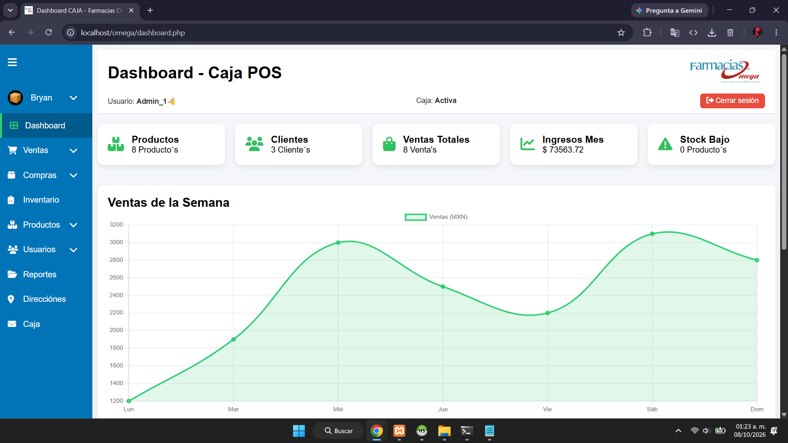
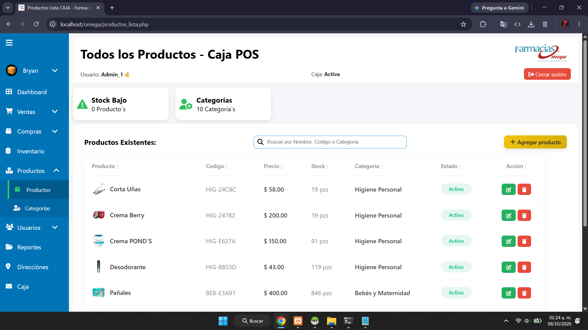
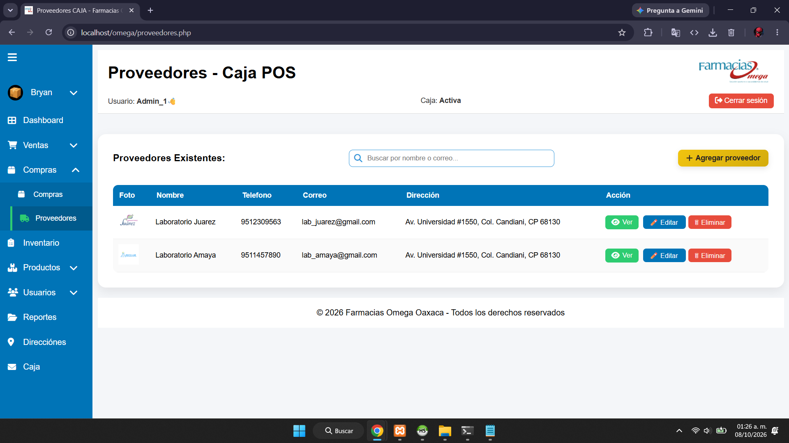
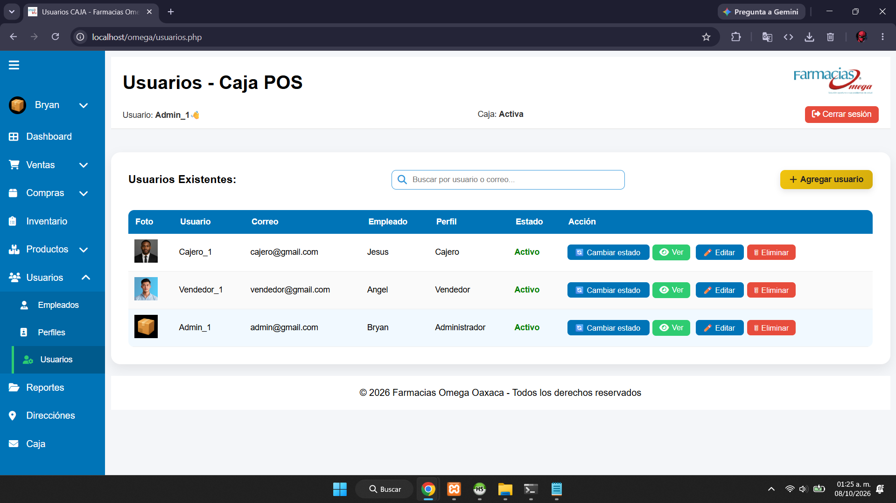
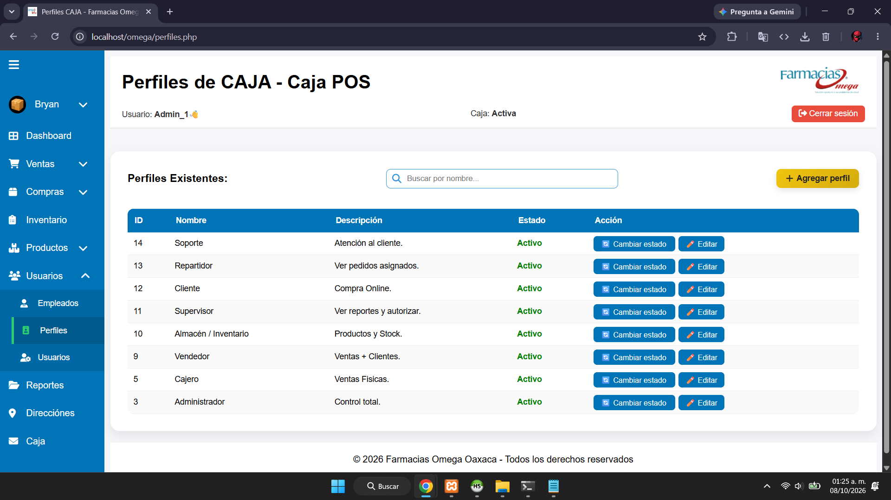
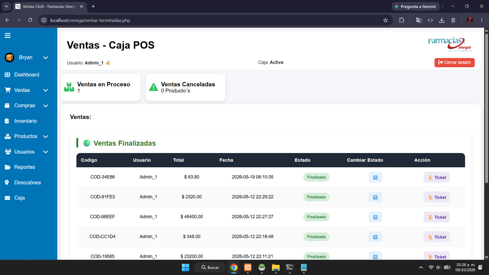
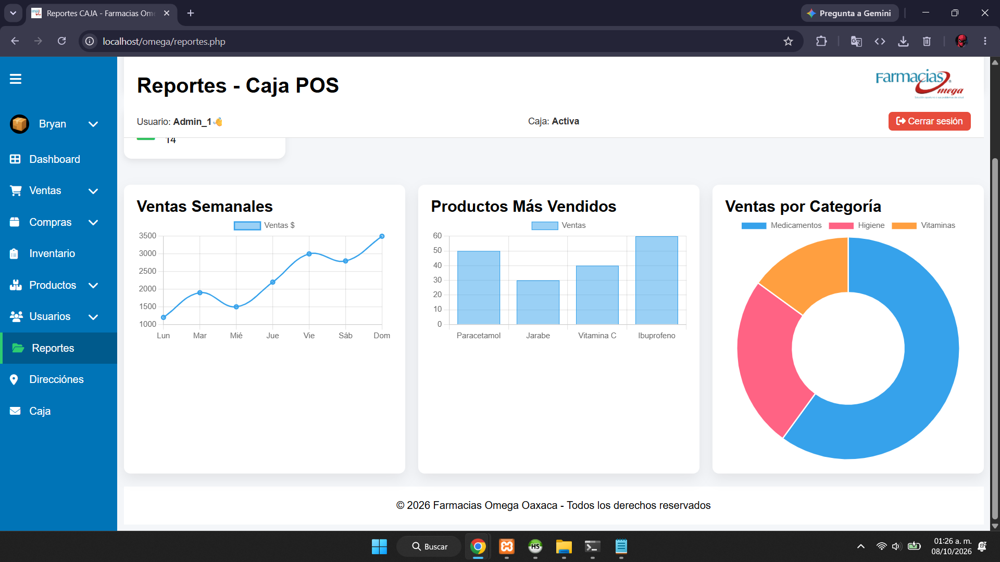

# 💊 FARMACIAS OMEGA



**"Sistema Integral de Gestión Farmacéutica"**
*Administración de ventas, inventario y operaciones*

🚀 **Bienvenido a Farmacias Omega**
Farmacias Omega es un sistema web diseñado para optimizar la gestión interna de una farmacia, permitiendo controlar inventario, ventas, compras, empleados, clientes y proveedores de forma eficiente.

Su objetivo es automatizar procesos administrativos y operativos, mejorando la organización, productividad y control del negocio.

---

## 🔹 Características

* 💊 Gestión completa de productos farmacéuticos
* 📦 Control de inventario en tiempo real
* 🛒 Registro y administración de ventas
* 💰 Control de caja y movimientos financieros
* 📑 Gestión de compras y abastecimiento
* 👥 Administración de clientes
* 🚚 Gestión de proveedores
* 🧑‍💼 Control de empleados
* 🏷️ Organización por categorías de productos
* 📍 Gestión de direcciones y sucursales
* 📊 Dashboard con estadísticas y reportes
* 🔐 Sistema de autenticación y control de acceso

---

## 🖼️ Capturas

### Dashboard principal


### Gestión de productos



### Gestión de proveedores



### Gestión de usuarios



### Gestión de perfiles



### Gestión de ventas



### Gestión de reportes



---

## ⚡ Tecnologías utilizadas

* **PHP**
* **MySQL**
* **HTML5**
* **CSS3**
* **JavaScript**
* **Chart.js**
* **XAMPP**

---

## 📂 Estructura del proyecto

```bash
FarmaciasOmega/
│── bd/                      # Base de datos SQL
│── css/                     # Archivos de estilos
│── js/                      # Scripts JavaScript
│── img/                     # Recursos visuales
│── ima\\\_productos/           # Imágenes de productos
│── ima\\\_usuarios/            # Imágenes de usuarios
│── ima\\\_empleados/           # Imágenes de empleados
│── ima\\\_proveedores/         # Imágenes de proveedores
│── auth.php                 # Validación de sesión
│── conexion.php             # Conexión a base de datos
│── dashboard.php            # Panel principal
│── inventario.php           # Gestión de inventario
│── ventas.php               # Gestión de ventas
│── compras.php              # Gestión de compras
│── caja.php                 # Control de caja
│── clientes.php             # Gestión de clientes
│── proveedores.php          # Gestión de proveedores
│── empleados.php            # Gestión de empleados
│── categorias.php           # Gestión de categorías
│── productos\\\_lista.php      # Lista de productos
│── reportes.php             # Reportes del sistema
```

---

## 🚀 Instalación

1. Clona este repositorio:

```bash
git clone https://github.com/tuusuario/farmacias-omega.git
```

2. Mueve el proyecto a tu carpeta de servidor local:

```bash
xampp/htdocs/
```

3. Importa la base de datos:

```bash
bd/omega2.sql
```

4. Configura la conexión en:

```bash
conexion.php
```

5. Inicia Apache y MySQL desde XAMPP.
6. Abre en tu navegador:

```bash
http://localhost/farmacias-omega
```

---

## 🔒 Seguridad

Farmacias Omega implementa:

* Control de sesiones de usuarios
* Protección de acceso mediante autenticación
* Validación de formularios
* Gestión segura de información
* Restricción de acceso por roles

---

## 📌 Estado del proyecto

🟢 En desarrollo activo

---

## 👨‍💻 Autor

Desarrollado por **El_Inge**

